# Crux

**AI research that stress tests its own conclusions.**

Crux is a research engine for hard market, business and strategy questions. Using SERV Reasoning, it forms a thesis, stress tests it against the evidence and audits it. Instead of searching for support and writing a confident report, it commits to a first answer, looks hard for what would make that answer wrong, re-judges it, and shows you exactly what changed and why. Every fact it uses is matched to the exact words in its source.

Built on [SERV Reasoning](https://docs.openserv.ai/serv-reasoning/why) (OpenServ) for every reasoning step and [Tavily](https://tavily.com) for web search.

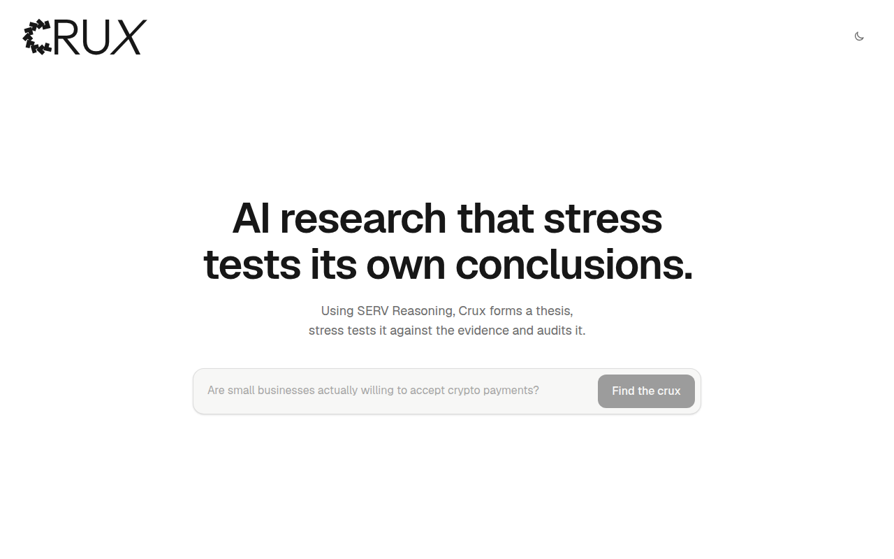

## Try it in a few minutes

Every number below is from a real run of the demo question on 26 September 2026, with live SERV and Tavily calls.

1. Run the app (see [Run it locally](#run-it-locally)) and open http://localhost:3000.
2. The demo question, **"Are small businesses actually willing to accept crypto payments?"**, is shown faintly in the box. Press **→** (or Tab) to fill it in, or tap the box on a phone.
3. Choose **Find the crux**. The report fills in stage by stage as each one finishes:

   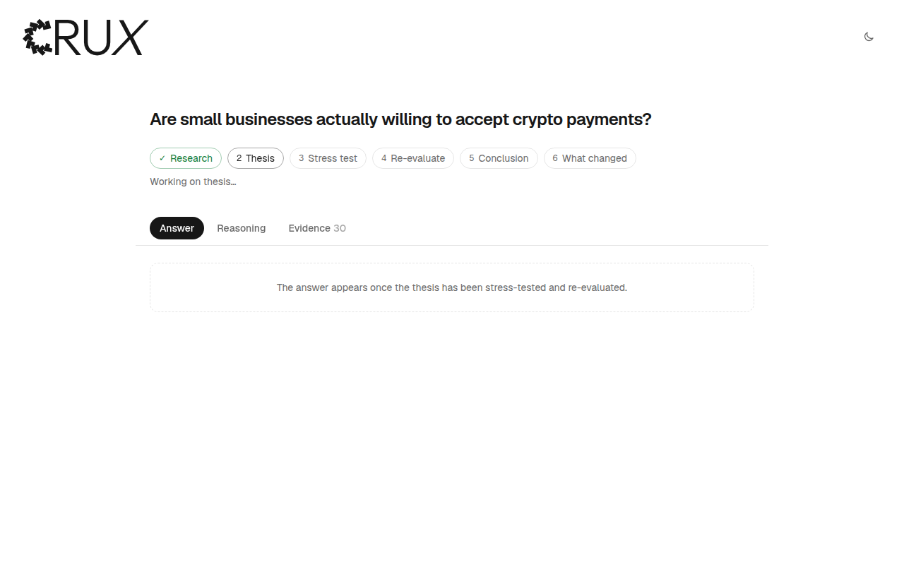

   | Stage | What happens | Time |
   | --- | --- | --- |
   | Research | SERV plans 8 searches (half of them hunting for evidence against), Tavily runs them, 20 sources are picked, SERV extracts facts and Crux checks every quote | 30.5 s |
   | Thesis | SERV commits to a first answer and names the assumptions it rests on | 7.7 s |
   | Stress test | SERV challenges the thesis: weak assumptions, contradicting evidence, other explanations, risks, missing evidence | 10.6 s |
   | Re-evaluate | Every assumption is re-judged against the evidence and the challenges | 11.0 s |
   | Conclusion | The best-supported answer, its confidence, what's uncertain and what to check next | 7.2 s |
   | What changed | Assembled from the recorded stages, no model call | 0 s |

   About a minute in total, 6 SERV calls and 8 Tavily searches.
4. Read the **Answer**, then open **Reasoning** and **Evidence**. Anything backed by facts has an **Evidence** link that opens just those facts.
5. Choose **Download** for the report as a PDF.

No keys? **Mock mode** runs the same app on built-in sample data at no cost. See [Run it locally](#run-it-locally).

## The problem

Most AI research tools search for evidence that supports an answer and then write it up confidently. They rarely look for the case against, the sources behind the claims are hard to check, and you can't see whether the reasoning ever changed its mind. For a decision like launching a product or entering a market, that confidence is the risk.

## What Crux does

### Answer

The conclusion comes first, with its confidence and whether the stress test strengthened, weakened or overturned the first answer. From the demo run:

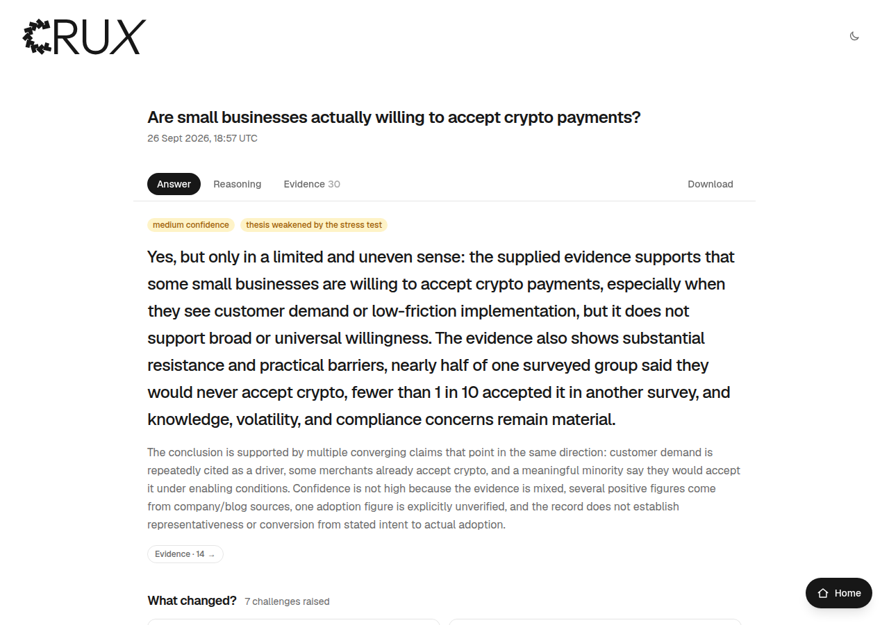

### What changed?

The first answer next to the answer after the stress test, and every material change with the reason and the evidence behind it. This view is assembled from what the stages actually recorded; it isn't generated after the fact.

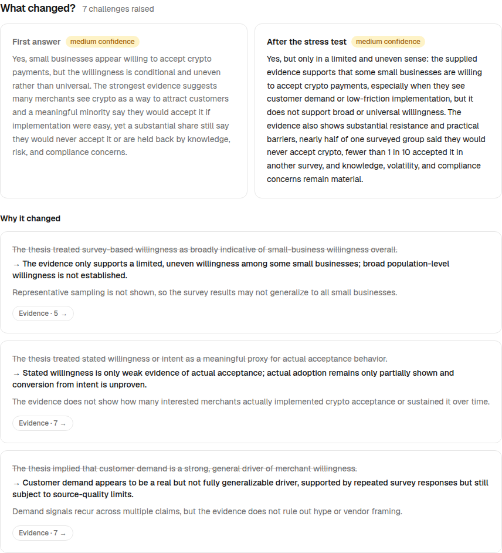

In the demo run, the thesis was **weakened**: three changes, each backed by specific facts and challenges, turned "many merchants are willing, with conditions" into "some are, but not broadly, and stated willingness is not proof of adoption".

### Stress test

SERV acts as a skeptical investor and challenges the first answer. Each challenge has a severity and a type, names the assumptions it targets, and links to its evidence. The demo run raised 7 challenges, 1 of them critical.

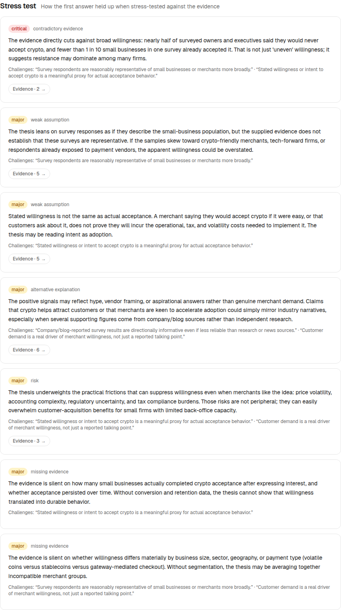

### Assumptions, re-judged

Every assumption the thesis depends on gets a verdict: supported, weakened, contradicted or unresolved, with the reasoning. If the re-evaluation skips one, Crux marks it unresolved rather than letting it pass silently. In the demo run: 2 weakened, 2 supported.

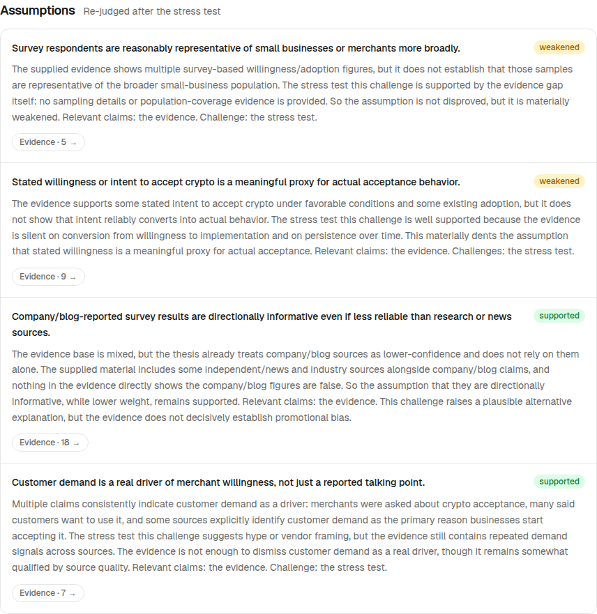

### Evidence, fact-checked

Every fact shows the exact words it came from, with a link to the source. The summary at the top says how many extracted facts were dropped because their quote wasn't in the source, and sources are labelled by type. The demo run kept all 30 facts it extracted (23 for, 6 against, 1 neutral) from 20 sources, and flagged 1 whose year wasn't in its quote.

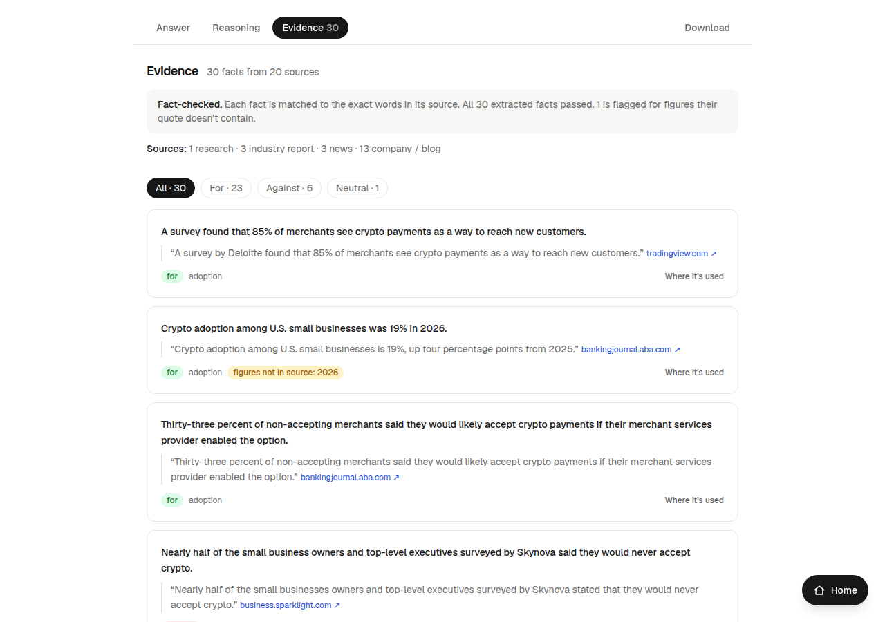

Evidence links elsewhere in the report open this view filtered to the facts behind one point:

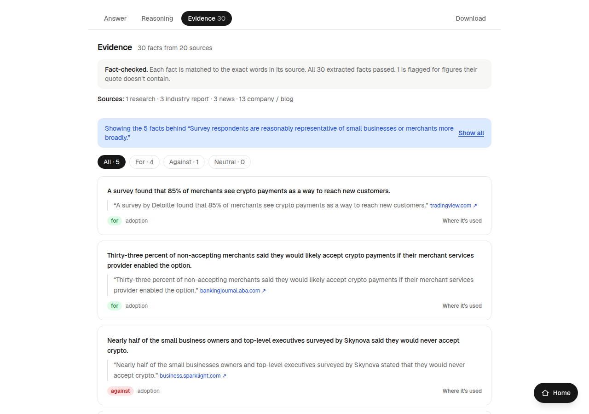

### Audit trail

**Where it's used** on any fact opens its trail in both directions: the source and quote it rests on, and every place in the reasoning that relies on it (the thesis, assumptions, challenges, re-evaluation, conclusion).

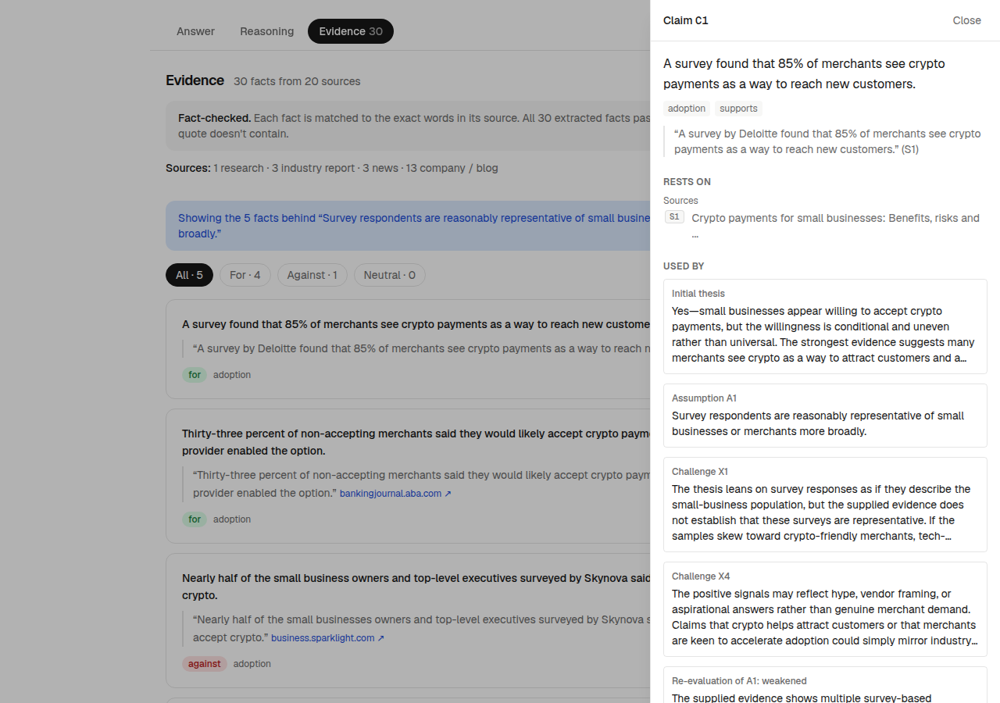

### PDF report

**Download** saves the whole report as a PDF straight to your device, built in the browser: the answer and what changed, then the reasoning, then the evidence as an appendix with every quote and a numbered source list.

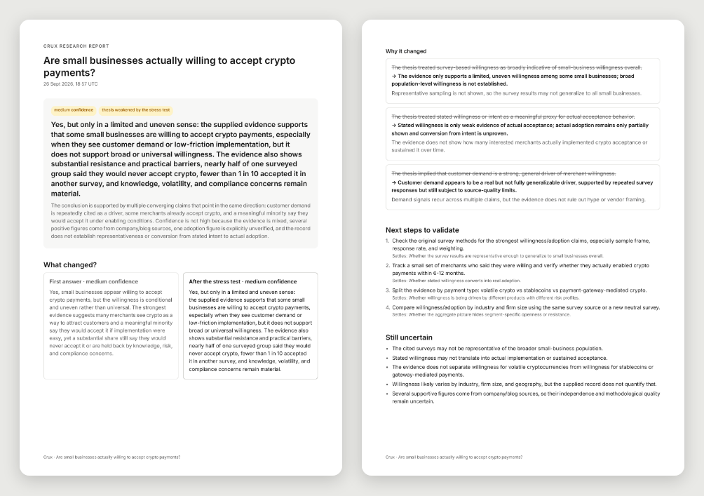

### Light and dark, desktop and phone

The toggle at the top right switches light and dark (it follows the device until you use it, with no flash on load). Every view works from 320 px phones up.

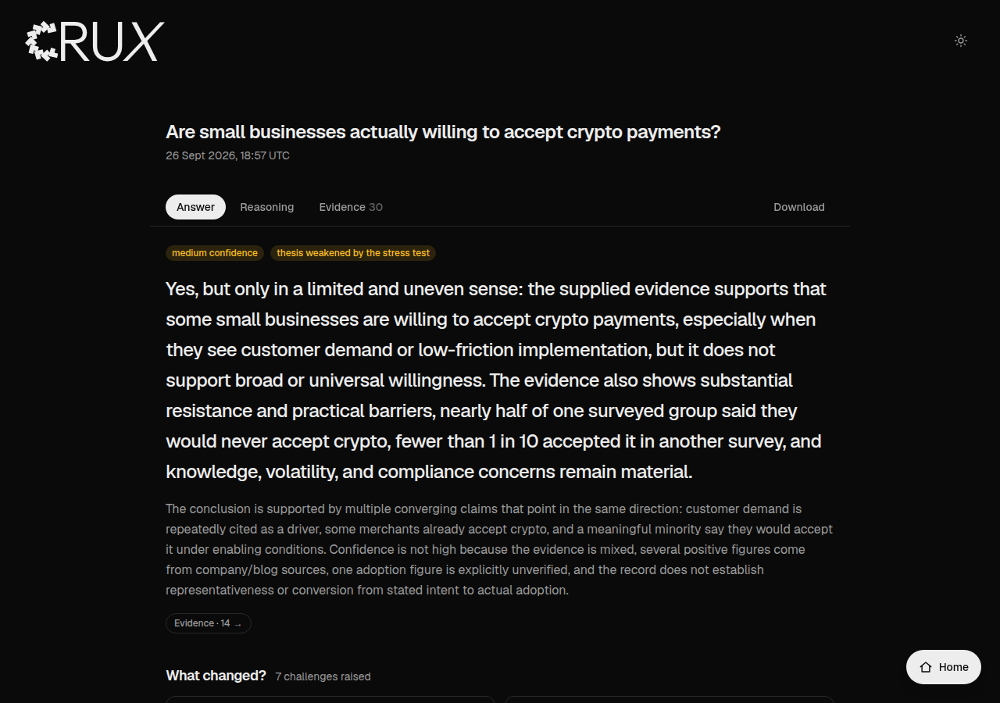

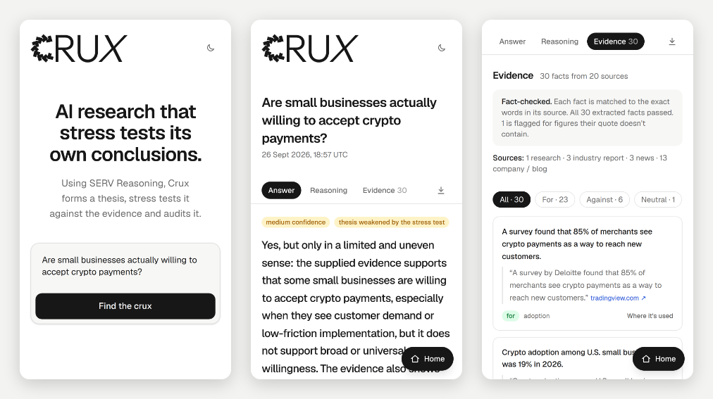

## How SERV does the reasoning

Every reasoning step is a separate SERV Reasoning call (OpenAI-compatible chat completion) with a strict JSON schema, so each stage's output is structured, recorded and auditable, never free text.

| Call | Input | Output |
| --- | --- | --- |
| Query plan | The question | 2 to 4 supporting and 3 to 4 challenging searches (the schema requires both) |
| Claims | The question and up to 20 source excerpts | Facts, each with the exact quote from its source, a category and a stance; plus each source's publisher type |
| Thesis | The checked facts | A first answer, its confidence and why, the assumptions it depends on, the facts behind it |
| Stress test | Facts and thesis | Challenges with type, severity, target assumptions and evidence; failure conditions; missing evidence |
| Re-evaluation | Facts, thesis, stress test | A verdict and reasoning for every assumption, the revised thesis, every change and what caused it |
| Conclusion | The whole record | Final answer, confidence, key supporting and challenging facts, uncertainties, next validation steps |

Each call also carries SERV's `serv_prompt_guard`, because the stages read untrusted web text. Model: `gpt-5.4-mini` through SERV by default (`SERV_MODEL` to change it). `SERV_SHADOW_AGENT=1` adds SERV's shadow-agent check to every stage.

## Architecture

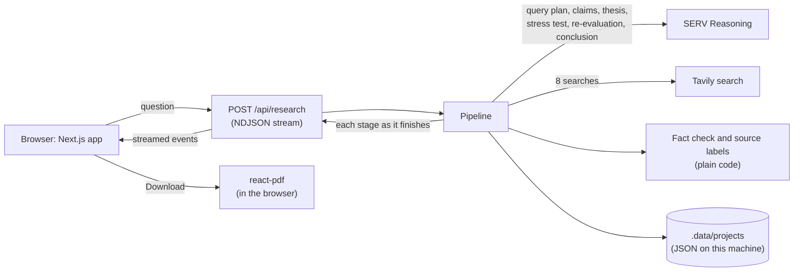

1. The browser posts the question; the API streams one event per stage back as NDJSON, so the report fills in live.
2. The pipeline ([src/lib/pipeline.ts](src/lib/pipeline.ts)) runs the stages in order and records an audit entry for each: model, duration, inputs, output and warnings.
3. Research ([src/lib/research/collect.ts](src/lib/research/collect.ts)) plans the searches, runs them, picks sources query by query, and has SERV extract facts; the fact check and source labels are plain code.
4. The reasoning stages ([src/lib/reasoning/stages.ts](src/lib/reasoning/stages.ts)) cite records by ID. Unknown IDs are removed and logged before anything is saved.
5. Runs are saved as JSON on the machine running the app and reopen at `/research/:id`. Nothing is sent anywhere else.

## Honest by design

A research tool is only useful if you can trust what it shows, so the rules below are enforced in code, with the prompts as a second layer.

| Rule | How it is enforced |
| --- | --- |
| Every fact is backed by its source's own words | SERV must quote each source it cites. [verify.ts](src/lib/research/verify.ts) checks each quote against the source text (ignoring case, spacing, curly quotes and dashes; `...` may skip words, in order). A source whose quote isn't found stops backing the fact; a fact with no quote found is dropped and counted in the summary |
| Figures must match | A figure a fact states (in digits) must appear in one of its quotes, as digits or words ("thirty-three" matches 33). If not, the fact is kept, flagged in the report, and passed to the later stages as unverified |
| The case against is always searched for | The query-plan schema requires 3 to 4 challenging searches. They run interleaved with the supporting ones, and sources are picked search by search in turn, so a supporting search's higher relevance scores can't crowd them out |
| A missing case against is called a gap, not proof | If no evidence against the answer survives, the later stages are told so explicitly, and the Evidence view says so |
| Weak sources count for less | Social posts and sources over three years old are flagged, only fill source slots the others leave open, and facts resting only on them are marked as weak evidence for the later stages and in the report |
| Citations can't dangle | Every ID a stage cites is checked against the records that exist. Unknown ones are removed and logged, so every audit-trail link leads somewhere |
| No assumption is skipped | The re-evaluation must judge every assumption; any it leaves out is recorded as unresolved |
| What changed is not rewritten | It's assembled from the recorded thesis, stress test and re-evaluation, not generated separately |
| Web text is untrusted | Excerpts are labelled as untrusted in every prompt and every call carries SERV's prompt guard |

Two limits to be plain about: a fact's **stance** (for or against) and the **type** of an unrecognised source are the model's judgement, and the fact check proves the quote is real, not that the fact's wording is a perfect paraphrase beyond its figures.

## What was checked

- **Live runs with SERV and Tavily.** Four live runs of the crypto question on 26 September 2026. From the second run on, after the balanced-research change, evidence went from 24 for and 0 against to a real case against (9 against in the third run, 6 in the fourth), and source types from "20 company / blog" to a mix of research, industry, news and company sources.
- **The screenshots** are from the fourth run, made after the last round of fixes and shown exactly as it came back. All 30 extracted facts passed the quote check; 1 is flagged because it says "in 2026" while its quote doesn't give a year.
- **Unit tests** (`npm test`, 66 tests): quote verification, figures in digits and words, source labels and selection, balanced queries, ID and dash stripping (only this run's IDs, ranges and abbreviations handled), prompt-guard retries, and the full pipeline on sample data.
- **The UI in a real browser** (headless Chromium): every view at 320, 360, 390 and 1200 px, light and dark, no sideways scrolling, PDF downloads from sample and live reports, the demo question by arrow key and by tap.
- **Type check, lint and production build** are clean (`npm run typecheck`, `npm run lint`, `npm run build`).

## Run it locally

You need [Node.js](https://nodejs.org) 22 or newer.

```bash
git clone https://github.com/Mhiah/crux.git
cd crux
npm install
cp .env.example .env.local   # then add SERV_API_KEY and TAVILY_API_KEY
npm run dev                  # open http://localhost:3000
```

**Mock mode** runs everything on built-in sample data, with no SERV or Tavily calls and no cost. It's used automatically when the keys are missing, or you can force it:

```bash
CRUX_MOCK=1 npm run dev                    # macOS / Linux
$env:CRUX_MOCK="1"; npm run dev            # Windows PowerShell
```

Mock runs always show the same sample report (about AI bookkeeping for Nigerian SMEs), whatever you ask, and are labelled as mock.

**Live mode** uses your keys: about 6 SERV calls and 8 Tavily searches per question, around a minute. On Windows, clear mock mode first with `Remove-Item Env:CRUX_MOCK`, or open a new PowerShell window.

**On a phone:** keep the app running, connect the phone to the same Wi-Fi, and open the **Network** address that `npm run dev` prints (for example `http://192.168.0.3:3000`).

| Variable | Purpose |
| --- | --- |
| `SERV_API_KEY` | SERV Reasoning. Without it, reasoning uses sample data |
| `TAVILY_API_KEY` | Web search. Without it, research uses sample sources |
| `SERV_MODEL` | Model to use through SERV (default `gpt-5.4-mini`) |
| `SERV_SHADOW_AGENT` | `1` adds SERV's shadow-agent check to each stage (extra calls) |
| `CRUX_MOCK` | `1` forces mock mode even with keys |

Other commands:

```bash
npm run research -- "Should we launch an AI bookkeeping SaaS for Nigerian SMEs?"   # run from the terminal
npm test            # unit tests
npm run typecheck
npm run lint
npm run build
```

## Project layout

```
src/
  app/
    page.tsx                  Home page and live results
    research/[id]/page.tsx    A saved report
    api/research/             POST a question (streams NDJSON), GET a saved run
    icon.svg                  Tab icon
  components/
    workstation.tsx           Answer, Reasoning and Evidence views
    report-pdf.tsx            The PDF report
    refs.tsx                  Audit-trail panel
    brand.tsx                 The CRUX wordmark
    site-header.tsx, theme-toggle.tsx, home-button.tsx
  lib/
    pipeline.ts               Runs the stages and records the audit trail
    reasoning/                SERV client, prompts, strict schemas, stages
    research/                 Search, source selection, fact check, source labels
    plain.ts                  Turns cited IDs into plain sentences and Evidence links
    trace.ts                  Resolves any record to what it rests on and what uses it
    mock/                     Sample data for mock mode
    types.ts                  The data model
tests/                        Vitest unit tests
docs/screenshots/             The images in this README
```

## Known limitations

- **Evidence depth.** Each run reads up to 20 sources, and only the excerpt Tavily returns for each (up to 2,500 characters), not whole pages.
- **Judgement calls.** A fact's stance and the type of an unrecognised source come from the model. Recognised sites are labelled by address.
- **What the fact check proves.** That each quote really appears in its source, and that the fact's figures appear in it. It doesn't prove the fact's wording is a faithful summary beyond that. Spelled-out numbers are read up to ninety-nine.
- **SERV's prompt guard** occasionally blocks harmless requests. Blocks are retried up to twice; if a run still fails, running it again usually works.
- **One model.** Runs use `gpt-5.4-mini` through SERV unless `SERV_MODEL` is set; other models haven't been tested.
- **Runs stay on one machine.** Reports are saved as local files and shared by downloading the PDF. There are no accounts and no hosted version.
- **Mock mode** has one sample report, whatever the question.
- **The PDF has no page numbers.**
- **No CI.** The checks are the unit tests, type check, lint, build and browser runs listed above.
